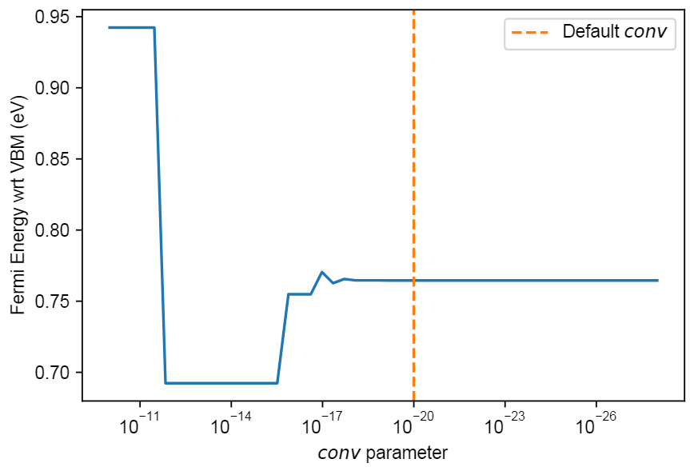

# py-sc-fermi


[](https://codeclimate.com/github/bjmorgan/py-sc-fermi/test_coverage)  

Originally an implementation of the FORTRAN code [SC-FERMI](https://github.com/jbuckeridge/sc-fermi), `py-sc-fermi` calculates self-consistent Fermi energies and defect concentrations under thermodynamic equlibrium given defect formation energies (in ionic crystals). For the theory, see https://doi.org/10.1016/j.cpc.2019.06.017.   

The inputs are (charged) defect formation energies, an (electronic) density of states and a file which describes the bulk crystal structure, such as a `VASP` POSCAR, a `.cif` file etc. Having this data, a `DefectSystem` object can be inititalised, properties of which include the self consistent Fermi energy, defect concentrations and defect transition levels. Basic usage can be found in `examples/example_workflow.ipynb`.

### A note on convergence testing.

`py-sc-fermi` offers a numerical approach to solving for the concentrations of a set of point defects in an ordered crystalline host with a knowledge of the defect formation energies. The search is guided by the constraint that the defective system must be charge neutral, or rather the net charge density should equal zero. We implement a convergence tolerance for the solver: a maximum value of the charge density which we consider close enough to zero to be deemed a charge neutral condition. Various defect studies have been used to "stress-test" and determine a good default value which does not mean that solutions take very long to find, while also returning a well-converged self consistent Fermi energy. By default this value is set to `1e-20`, but best practice should include sweeping a variety of convergence tolerances to ensure this is satisfactory for your system.

For example, a loop over convergance tolerances may look something like this
```
efermi_convergence = []
conv_convergence = np.logspace(-10, -28)
for conv in conv_convergence:
    efermi_convergence.append(DefectSystem.get_sc_fermi(conv=conv))
```

returning a plot such as



### Citing

If you use py-sc-Fermi in your work, please consider citing 
- this repository (see `cite this repository` in the sidebar)
- the paper associated with the FORTRAN implementation which provides an excellent discussion of both the underlying theory and the self-consitent Fermi energy searching algorithm  

   > J. Buckeridge, Equilibrium point defect and charge carrier concentrations in a material determined through calculation of the self-consistent Fermi energy, Computer Physics      Communications, Volume 244, 2019, Pages 329-342, ISSN 0010-4655, https://doi.org/10.1016/j.cpc.2019.06.017.
