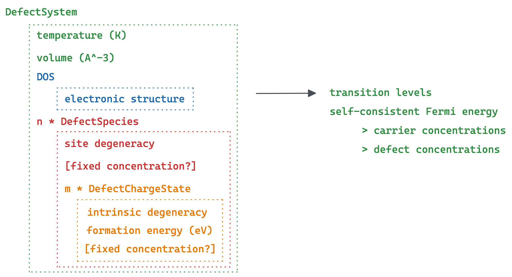

py-sc-fermi
=======================================

.. toctree::
   :hidden:
   :maxdepth: 2
   :caption: contents

   usage_notes
   source/tutorials
   source/py-sc-fermi

:py:mod:`py-sc-fermi` is an open-source Python package for calculating the concentration of point defects in (semiconducting) crystalline materials.
The required inputs are the volume, density of states of the bulk material, and the formation energies and degeneracies of the point defects. 
The outputs include the self consistent Fermi energy, defect transition levels, and concentrations of the point defects, electrons and holes at a given temperature.
:py:mod:`py-sc-fermi` uses a numerical method to solve for the self-consistent Fermi level in a material, necessary for accurately quantifing the populations of point defects in such materials. 

The approach used in this code was initially based off the algorithm used by the FORTRAN code `SC-Fermi <https://github.com/jbuckeridge/sc-fermi>`_, as described in this `Paper <https://www.sciencedirect.com/science/article/pii/S0010465519302048>`_.

  

Papers that use :py:mod:`py-sc-fermi`
-------------------------------------
- `10.1021/acs.inorgchem.1c00278 <https://pubs.acs.org/doi/abs/10.1021/acs.inorgchem.1c00278>`_
- `10.1103/PhysRevMaterials.6.085401 <https://journals.aps.org/prmaterials/abstract/10.1103/PhysRevMaterials.6.085401>`_

Reference
==================

* :ref:`genindex`
* :ref:`modindex`
* :ref:`search`
