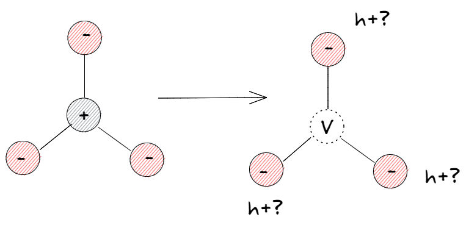

FAQs
=======================================

1. How do I define the degeneracy of a defect's charge state (``DefectChargeState``)? 
--------------------------------------------------------------------------------------

The degeneracy of a defect charge state is the number of energetically equivalent arrangements of defect *X* in charge state *q*.

Consider the following case where we have a trigonally coordinated cation with an oxidation state of +1 somewhere in our structure.
If that cation forms a neutral vacancy *V* and the hole associated with the defect is localised, it might localise on any of the three
near-neighbour anions. It could be spin up or spin down, so we have 6 unique ways this defect could localise.

If, however, the hole is delocalised, the degeneracy will be two, as the delocalised density can be spin up, or spin down.
