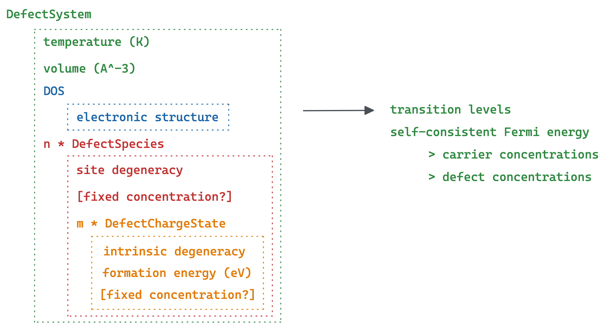

py-sc-fermi
=======================================

.. toctree::
   :hidden:
   :maxdepth: 4
   :caption: contents

   installation
   migrating_to_v3
   theory
   usage_notes
   tutorials
   FAQs
   citing
   py_sc_fermi

:py:mod:`py-sc-fermi` is an open-source Python package for calculating
equilibrium point-defect and carrier concentrations in crystalline
semiconductors. From the cell volume, the bulk density of states, and the
formation energies and degeneracies of a set of point defects, it solves
self-consistently for the Fermi level that enforces charge neutrality, and
returns the equilibrium defect, electron, and hole concentrations, together
with the defect transition levels, at a given temperature.

|

Quickstart
==========

.. code-block:: python

    from py_sc_fermi.dos import DOS
    from py_sc_fermi.defect_charge_state import DefectChargeState
    from py_sc_fermi.defect_species import DefectSpecies
    from py_sc_fermi.defect_system import DefectSystem

    # bulk density of states (the electron count and band gap are read from the vasprun)
    dos = DOS.from_vasprun("vasprun.xml")

    defects = [
        DefectSpecies(
            "V_O",
            nsites=2,
            charge_states=[
                DefectChargeState(charge=0, energy=4.7, degeneracy=1),
                DefectChargeState(charge=2, energy=1.1, degeneracy=1),
            ],
        ),
        # ... one DefectSpecies per defect
    ]

    system = DefectSystem(
        defect_species=defects,
        dos=dos,
        volume=250.0,      # cubic Angstroms
        temperature=1000,  # Kelvin
    )

    result = system.result
    print(result)           # self-consistent Fermi level, carriers, and defect concentrations
    result.fermi_energy     # Fermi level (eV, referenced to the valence-band maximum)
    result.concentrations   # {defect name: concentration in cm^-3}

The :doc:`tutorials` page walks through a complete example with these building
blocks, and the features below, in full.

Features
========

- Self-consistent solution of charge neutrality for the Fermi level, and the
  equilibrium defect, electron, and hole concentrations at a fixed temperature.
- Site-exclusion (Langmuir) statistics, capping each defect at its available
  sites.
- Temperature series and temperature-dependent band-edge shifts through
  ``DefectSystemFactory``.
- Frozen-defect and anneal-and-quench workflows through ``fixed_concentrations``.
- Share one set of sites among several defect species (``site_pools``), or
  constrain an element's total amount with the chemical potential solved to
  match (``element_pools``).
- Metastable charge states, combined into Boltzmann-weighted effective formation
  energies.
- Defect transition-level diagrams.

The physical model behind these features is set out in :doc:`theory`.

Upgrading from v2? The :doc:`migrating_to_v3` guide covers the breaking changes.

py-sc-fermi's self-consistent Fermi-level algorithm was originally based on that
of the FORTRAN code `SC-Fermi <https://github.com/jbuckeridge/sc-fermi>`_
(`Buckeridge 2019 <https://www.sciencedirect.com/science/article/pii/S0010465519302048>`_).

Searching
=========

:ref:`genindex` | :ref:`modindex` | :ref:`search`
